# Các sơ đồ UML của backend


## 1. Class Diagram — Sơ đồ lớp

```mermaid
classDiagram
  class Race { +UUID race_id; +string name; +datetime start_at; +datetime end_at; +string status; +int total_laps }
  class Student { +UUID student_id; +string student_code; +string full_name; +string faculty; +string status }
  class RunnerWearable { +string device_id; +UUID student_id; +string name; +string status; +datetime last_seen_at }
  class RaceParticipant { +UUID id; +string bib_number; +string registration_status }
  class Checkpoint { +UUID checkpoint_id; +string code; +int sequence_no; +string kind; +float latitude; +float longitude; +float radius_m }
  class RunSession { +UUID run_id; +UUID wearable_device_id; +datetime started_at; +datetime ended_at; +string status; +float distance_total_m; +int duration_total_s; +int lap_count; +int total_steps; +float last_latitude; +float last_longitude }
  class GpsPoint { +UUID gps_point_id; +UUID wearable_device_id; +float latitude; +float longitude; +datetime recorded_at; +datetime received_at; +int total_steps; +string source; +string idempotency_key }
  class LapEvent { +UUID lap_event_id; +datetime occurred_at; +int lap_no; +int duration_s; +string source; +string source_event_id; +string validation_status }
  class Device { +string device_id; +string name; +string status; +datetime last_seen_at }
  class DeviceEvent { +UUID device_event_id; +datetime occurred_at; +datetime received_at; +string event_type; +string source_event_id; +UUID student_id_nullable; +string identity_status; +string raw_payload }
  class RaceService { +create_race(); +overview(); +runners(); +live_snapshot() }
  class RunService { +start_run(); +accept_gps(); +record_lap(); +finish_run() }
  class DeviceService { +accept_passage(); +mark_unassigned() }
  class GeofenceDetector { +detect_entry(previous_gps, current_gps, checkpoint); +validate_lap_time() }
  class EventHub { +connect(); +disconnect(); +publish() }
  Race "1" --> "0..*" Checkpoint
  Race "1" --> "0..*" RaceParticipant
  Student "1" --> "0..*" RaceParticipant
  Race "1" --> "0..*" RunSession
  Student "1" --> "0..*" RunSession
  Student "1" --> "0..*" RunnerWearable : assigned
  RunnerWearable "1" --> "0..*" RunSession : bound device
  RunSession "1" --> "0..*" GpsPoint
  RunnerWearable "1" --> "0..*" GpsPoint : provides GPS and steps
  RunSession "1" --> "0..*" LapEvent
  Checkpoint "1" --> "0..*" LapEvent
  Device "1" --> "0..*" DeviceEvent
  Checkpoint "1" --> "0..*" DeviceEvent
  Student "0..1" --> "0..*" DeviceEvent : optional identity
  RaceService ..> Race
  RunService ..> RunSession
  DeviceService ..> DeviceEvent
  GeofenceDetector ..> Checkpoint : checks radius
  GeofenceDetector ..> LapEvent : creates assigned GPS lap
  EventHub ..> RunService : publishes committed events
```

## 2. Object Diagram — Sơ đồ đối tượng

Snapshot minh họa một thời điểm giữa giải: GPS/steps wearable đã gán cho runner, vị trí vừa đi vào checkpoint geofence và backend ghi lap.

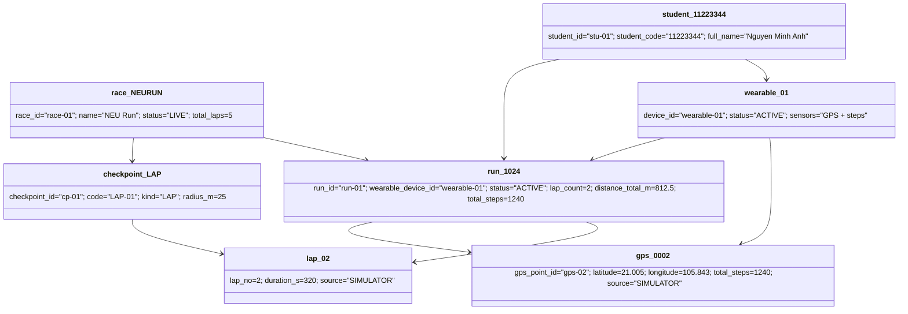

## 3. Component Diagram — Sơ đồ thành phần

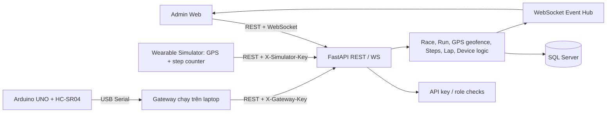

## 4. Composite Structure Diagram — Sơ đồ cấu trúc kết hợp

Nội bộ thành phần Run/Telemetry: phần tiếp nhận kiểm tra hợp đồng và quyền trước; logic chỉ cập nhật tổng khi dữ liệu hợp lệ; lưu DB xong mới phát event.

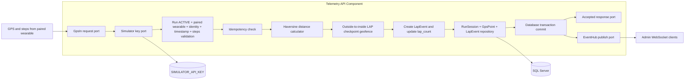

## 5. Deployment Diagram — Sơ đồ triển khai

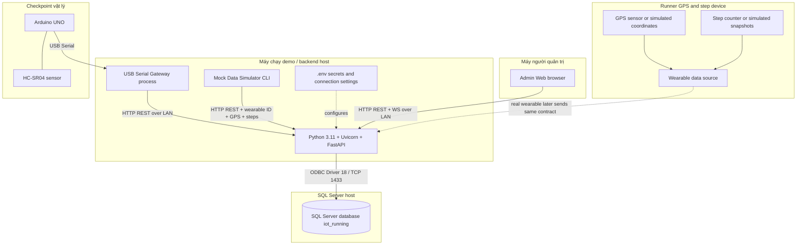

## 6. Package Diagram — Sơ đồ gói

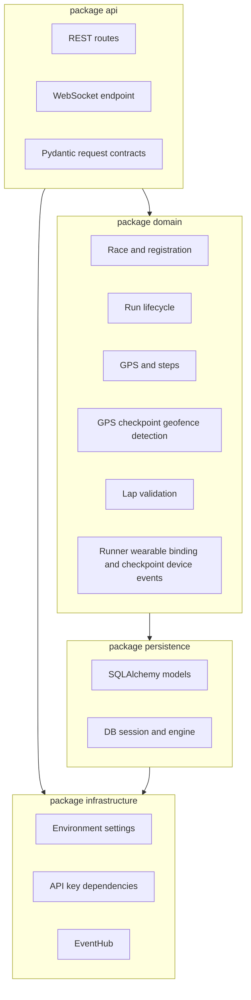

## 7. Profile Diagram — Sơ đồ cấu hình / hồ sơ

Các stereotype mở rộng UML dùng để giải thích miền IoT trong hệ thống. Áp dụng profile này lên lớp/endpoint tương ứng khi vẽ lại bằng công cụ UML hỗ trợ Profile.

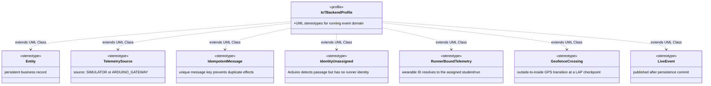

## Quan hệ cốt lõi dạng ER

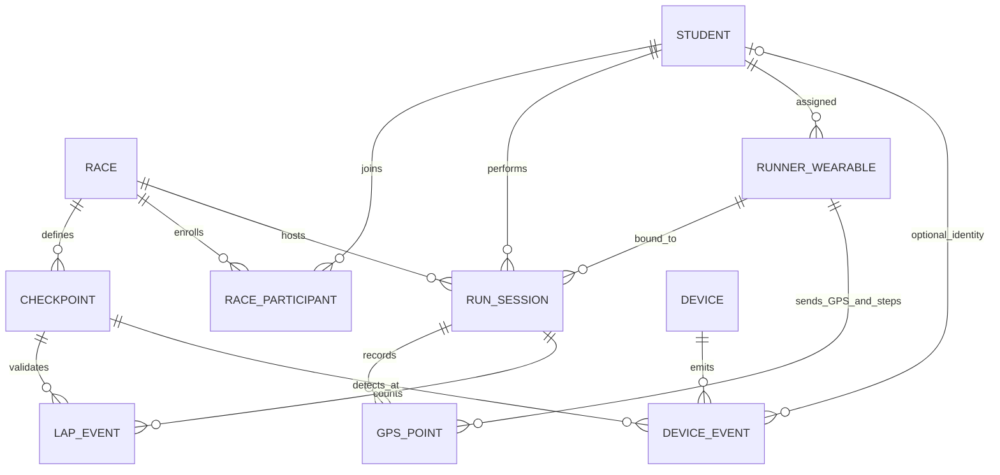

## 8. Use Case Diagram — Sơ đồ ca sử dụng

Mô tả các tác nhân và chức năng chính. Người chạy và thiết bị đeo gửi dữ liệu; quản trị viên theo dõi giải qua web; gateway checkpoint gửi sự kiện phát hiện người qua nhưng không nhận diện được sinh viên.

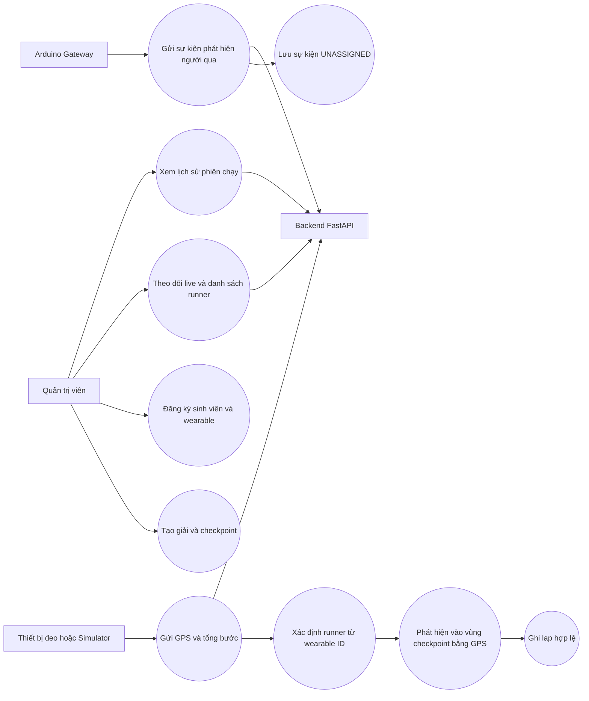

## 9. Sequence Diagram — GPS, bước chân và phát hiện lap

Luồng dưới đây cho thấy backend ràng buộc wearable với runner, xác thực mẫu GPS/bước chân, phát hiện chuyển từ ngoài vào trong vùng LAP, commit dữ liệu rồi mới gửi WebSocket.

```mermaid
sequenceDiagram
  actor Wearable as Wearable / Simulator
  participant API as FastAPI GPS API
  participant DB as SQLAlchemy Database
  participant Geo as Geofence Detector
  participant Hub as WebSocket EventHub
  participant Web as Admin Web
  Wearable->>API: POST /api/v1/telemetry/gps (device_id, run_id, GPS, steps)
  API->>API: Kiểm tra API key, run ACTIVE, wearable thuộc runner
  API->>DB: Đọc GPS trước, checkpoint và khóa idempotency
  API->>API: Kiểm tra timestamp, tọa độ, bước chân, tốc độ
  alt Mẫu hợp lệ và không trùng
    API->>Geo: Kiểm tra previous outside -> current inside
    Geo-->>API: Kết quả crossing và checkpoint LAP (nếu có)
    API->>DB: Lưu GPS; cập nhật tổng quãng đường/bước
    opt Có crossing hợp lệ và đủ thời gian lap tối thiểu
      API->>DB: Tạo LapEvent, tăng lap_count
    end
    API->>DB: COMMIT transaction
    API->>Hub: Publish gps.updated và checkpoint.passed sau commit
    Hub-->>Web: WebSocket event cho race
    API-->>Wearable: 202 Accepted
  else Dữ liệu sai hoặc trùng
    API-->>Wearable: Từ chối hoặc trả kết quả idempotent
  end
```

## 10. Activity Diagram — Quy trình xử lý telemetry GPS

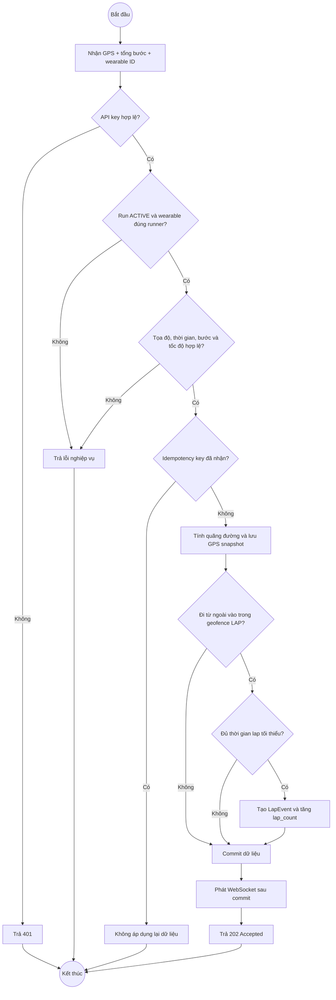

## 11. State Machine Diagram — Trạng thái phiên chạy

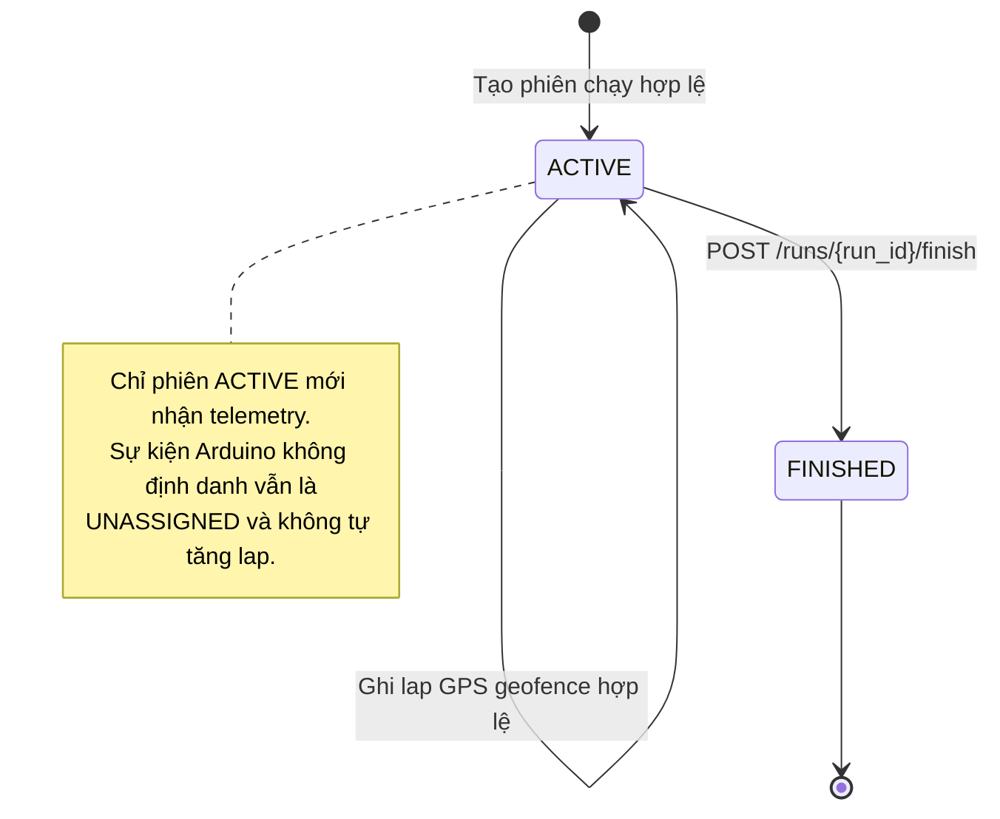

## 12. Sequence Diagram — Sự kiện checkpoint Arduino không định danh

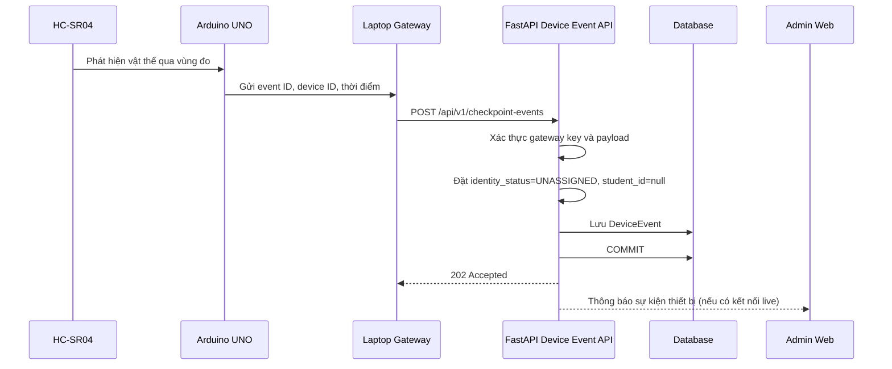

## 13. Communication Diagram — Sơ đồ giao tiếp

Sơ đồ nhấn mạnh các liên kết giữa đối tượng và đánh số thông điệp theo thứ tự. Mermaid chưa có cú pháp UML Communication riêng, vì vậy sơ đồ dưới đây dùng `flowchart` để mô phỏng các đối tượng và nhãn thông điệp.

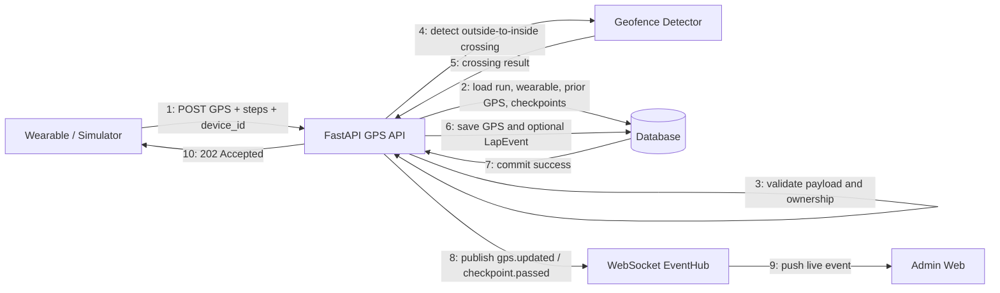

## 14. Interaction Overview Diagram — Tổng quan tương tác

Sơ đồ này ghép luồng điều khiển nghiệp vụ với các tương tác chính. Các nhãn `I1` và `I2` tham chiếu lần lượt đến luồng GPS/lap ở sơ đồ tuần tự mục 9 và luồng Arduino ở mục 12.

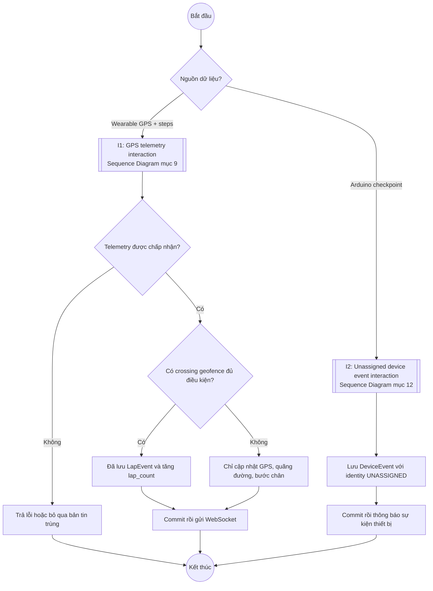
